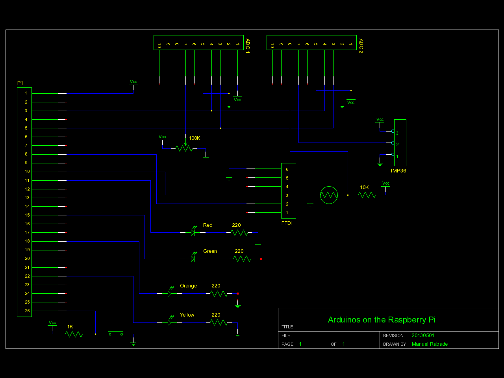
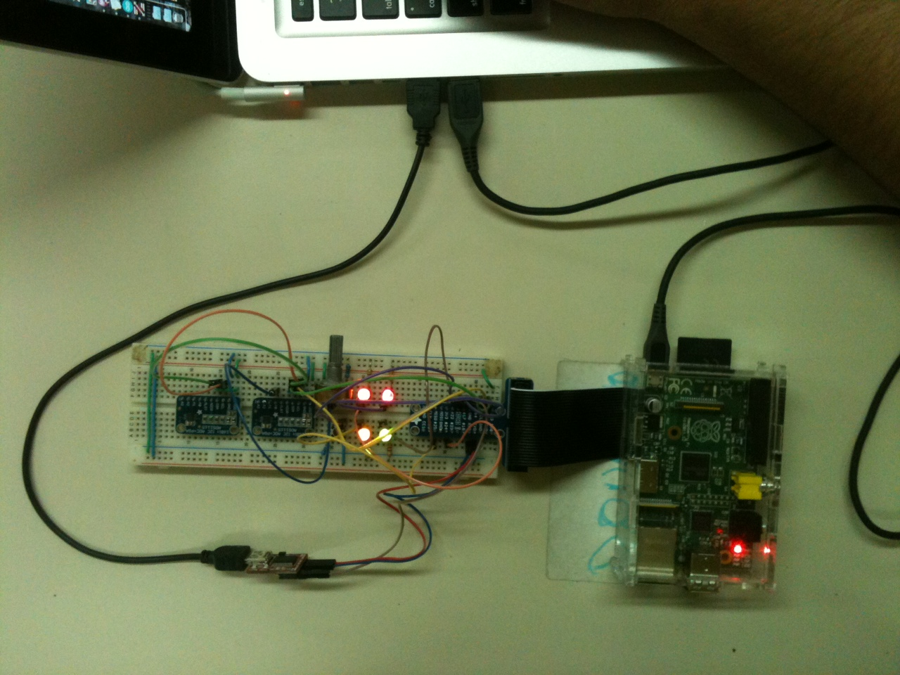

Arduinos on the Raspberry Pi
============================

This project solves the [Space Apps 2013 Ardusat
challenge](http://2013.spaceappschallenge.org/challenge/ardusat/) by
using a [Raspberry Pi](http://www.raspberrypi.org/) running
[ChibiOS](http://www.chibios.org/), a Real Time Operating System for
embedded systems, to emulate serveral [Arduino](http://arduino.cc/)
boards.

Inside ChibiOS threads runs Arduino code with help of a library that
mimics the Arduino platform. The RTOS can be configured to map pins and
devices betwen the Raspberry Pi and the virtual Arduinos allowing the
maximum use of the sensors in Ardustat. The code and configuration
running on the Raspberry pi can be uploaded via serial console for
remote management.

Build & Run
-----------

#### 1. Wire the prototype

#### 2. Install the GNU ARM toolchain

In MAC OS X you can use [Yagarto](http://www.yagarto.de/#downloadmac)
and in Linux you can use [yol](https://github.com/phaenovum/yol).

#### 3. Get ChibiOS for the RPi

    git clone https://github.com/steve-bate/ChibiOS-RPi

#### 4. Get Arduinos on the Raspbery Pi

    git clone https://github.com/manuel-rabade/arduino-chibios-rpi

#### 5. Build

    cd arduino-chibios-rpi && make
    cd arduino-chibios-rpi/bootloader && make

#### 6. Setup SD card

Copy `arduino-chibios-rpi/bootloader/kernel.img` to the SD
card. Download [bootcode.bin and
start.elf](https://github.com/raspberrypi/firmware) and copy them to
the SD card.

#### 7. Serial console

Install minicom and configure it:

    Serial Device : /dev/ttyUSB0 
    Bps/Par/Bits : 115200 8N1
    Hardware Flow Control : No
    Software Flow Control : No

#### 8. Boot

Power your Raspberry Pi and upload `arduino-chibios-rpi/build/ch.bin`
using XModem.

Serial console
--------------

Once ChibiOS has been uploaded the following commands are available in the serial shell:

*Virtual Arduinos status*

    ch> status

*Pause operation of a virtual Arduino*

    ch> pause [arduino #]

*Resume operation of a virtual Arduino*

    ch> resume [arduino #]

*Retrive serial buffer of a virtual Arduino*

    ch> log [arduino #]

*Memory usage*

    ch> mem

*Threads status*

    ch> threads

*ChibiOS build information*

    ch> info

*System time*

    ch> systime

*Reboot*

    ch> reboot

I/O configuration
-----------------

This project map the following Raspberry Pi pins to virtual Arduino
pins:

    Raspberry Pi    Virtual Arduino   Arduino pin
    GPIO22          arduino0          13
    GPIO7           arduino1          13
    GPIO25          arduino1          12
    GPIO17          arduino2          13
    GPIO24          arduino3          13

Hack
----

`arduino-chibios-rpi/main.cpp` it's the entry point that spawns the
threads.

`arduino-chibios-rpi/arduino/arduino0.cpp`,
`arduino-chibios-rpi/arduino/arduino1.cpp`,
`arduino-chibios-rpi/arduino/arduino2.cpp` and
`arduino-chibios-rpi/arduino/arduino3.cpp` are the code for each
virtual Arduino.

`arduino-chibios-rpi/arduino-chibios-rpi/arduino/arduino0.h`,
`arduino-chibios-rpi/arduino/arduino1.h`,
`arduino-chibios-rpi/arduino/arduino2.h` and
`arduino-chibios-rpi/arduino/arduino3.h` are the configuration for each
Arduino.

`arduino-chibios-rpi/arduino/arduino.h` and
`arduino-chibios-rpi/arduino/arduino.cpp` is the library that emulates
the Arduino plataform.

Prototype
---------

Videos
------

* [Arduinos on the Raspberry
  Pi](http://www.youtube.com/watch?v=Z6Uyguw1yAI)
* [Bootloader build and SD card
  setup](http://www.youtube.com/watch?v=gKtXT4GJeRg)
* [Upload, build and run](http://www.youtube.com/watch?v=D3jWURlTU5I)

References
----------

* [ChibiOS-RPi port and
  demos](https://github.com/steve-bate/ChibiOS-RPi) by Steve Bate
* [Raspberry Pi
  bootloader](https://github.com/dwelch67/raspberrypi/tree/master/bootloader05)
  by David Welch
* [Arduino languaje reference](http://arduino.cc/en/Reference/HomePage)
* [Arduino source code](http://github.com/arduino/Arduino)
* [Raspberry Pi Low-level
  peripherals](http://elinux.org/RPi_Low-level_peripherals)

Author
------

Manuel Rábade <[manuel@rabade.net](mailto:manuel@rabade.net)>

License
-------

This work is licensed under a [Simplified BSD License](LICENSE.txt).
